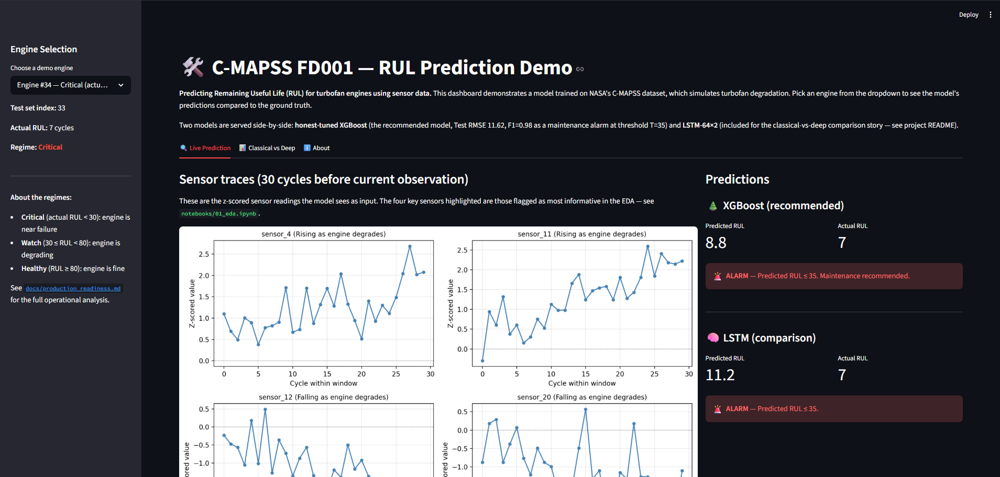
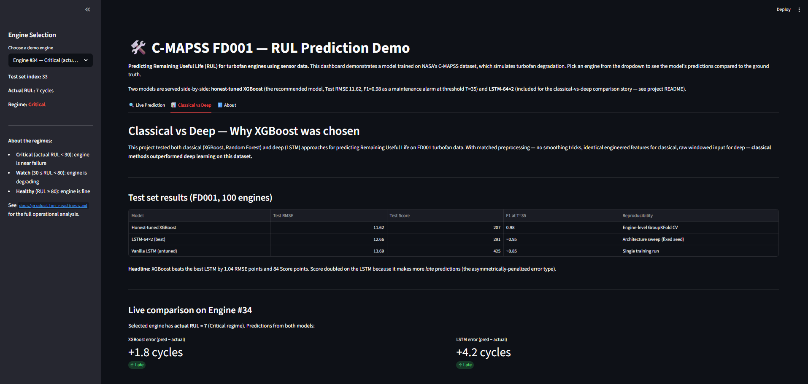

# Predictive Maintenance on NASA C-MAPSS Turbofan Data

End-to-end ML system predicting Remaining Useful Life (RUL) for rotating equipment, using NASA's C-MAPSS turbofan dataset as a proxy for industrial pumps and compressors.

**Test RMSE 11.62 · NASA Score 207 · F1 = 0.98 as a maintenance alarm at threshold T = 35.**

The same XGBoost model that scores a modest 11.62 RMSE on regression catches **100% of failure-imminent engines** (25 of 25) with only **1 false alarm out of 75 healthy engines** when used as an alarm classifier. The operational reframing matters more than the regression number.

## Live Demo

Two commands to run the demo locally:

```bash
# Terminal 1 — FastAPI inference service (port 8000)
uvicorn app.api:app --reload --port 8000

# Terminal 2 — Streamlit dashboard (port 8501)
streamlit run app/dashboard.py
```

Then open http://localhost:8501.

**The dashboard provides:**
- Six demo engines spanning Critical, Watch, and Healthy regimes
- Live RUL predictions from both XGBoost (recommended) and LSTM (comparison)
- Sensor traces showing the 30-cycle input window with the four most-informative sensors highlighted
- Alarm decisions at the operationally-recommended threshold
- A side-by-side Classical vs Deep comparison tab

The FastAPI service has auto-generated Swagger docs at http://localhost:8000/docs.

### Screenshots

**Live Prediction tab — Engine #34 (Critical regime, actual RUL = 7):**


**Classical vs Deep comparison tab:**


## Approach

This project builds the full ML pipeline end-to-end — EDA, feature engineering, classical and deep modeling, operational analysis, and deployment — with engineering rigor visible at every step.

- **Data & features:** 14 informative sensors retained from FD001's 21 channels (7 dropped for zero variance or quantization); 30-cycle sliding windows with engine-level train/val/test splits to prevent leakage; piecewise-linear RUL target capped at 125 cycles; 70 engineered tabular features (mean, std, slope, min, max per sensor) for tree models.
- **Modeling:** Honest-tuned XGBoost (Test RMSE 11.62) and Random Forest baselines; tested six LSTM architectures (best Test RMSE 12.66) — classical methods outperformed deep learning under matched preprocessing.
- **Interpretation:** SHAP analysis cross-validates the EDA findings — the model's top features (slopes of sensors 4, 11, 12, 20) match the sensors flagged in the EDA, with directional patterns that match the rising/falling categorization.
- **Operational analysis:** Per-regime calibration shows the model is dramatically more accurate in operationally-critical zones (RMSE 5.08 in the Critical regime) than the headline RMSE suggests. Alarm threshold sweep identifies T = 35 as the recommended operating point.
- **Deployment:** FastAPI inference service with Pydantic validation, lazy model loading, and 11 integration tests. Streamlit dashboard with three tabs visualizing predictions, the classical-vs-deep comparison, and project metadata.

## Key engineering decisions

A `docs/decisions.md` log captures ~30 dated entries explaining the reasoning behind each choice. The five most interview-relevant:

1. **Engine-level GroupKFold for hyperparameter tuning.** Initial Optuna runs used row-level CV and reported CV-RMSE 3.59 — leakage from consecutive windows of the same engine. Engine-level GroupKFold gave honest CV-RMSE 13.60 (4× different). Test RMSE improved from 12.55 (leaky) to 11.62 (honest) once the chosen hyperparameters reflected real generalization, not memorization.
2. **Three-way cross-check between EDA, features, and SHAP.** Week 2 EDA identified sensors 4, 11 as rising and 12, 20 as falling. Week 4 feature engineering measured slope-RUL correlations of |r| = 0.63–0.76 for those same four. Week 4 SHAP analysis ranked their slopes in the top 5 features by mean |SHAP|, with directional patterns matching the rising/falling categorization. Three independent analyses agreeing on the same physics.
3. **Winner's-curse detection in LSTM tuning.** Optuna tuning reported best val RMSE 11.77, but retraining with identical hyperparameters and seed produced val RMSE 13.03 — seed-induced variance larger than the apparent improvement. The architecture-sweep result (Test RMSE 12.66, reproducible across seeds) is reported as the best LSTM rather than the Optuna result that wouldn't replicate.
4. **Reframing regression as classification for operational utility.** The same XGBoost that scores Test RMSE 11.62 (modest) achieves F1 = 0.98 when used as a maintenance alarm at threshold T = 35. The regression-level prediction doesn't matter for the alarm decision — only which side of the threshold the prediction falls on. The model is highly discriminative even where its regression accuracy is imperfect.
5. **Per-regime calibration analysis.** The Critical regime (actual RUL < 30) has RMSE 5.08 — less than half the global RMSE. Aggregate metrics hide heterogeneity; the model is much better than its headline number suggests in the regime where operational decisions actually get made. See [`docs/production_readiness.md`](docs/production_readiness.md) for the full operational analysis.

## Results

### Test set performance (FD001, 100 engines)

| Model | Test RMSE | Test Score | Reproducibility |
|---|---|---|---|
| **Honest-tuned XGBoost** | **11.62** | **207** | Engine-level GroupKFold tuning |
| Regularized Random Forest | 12.57 | 252 | Default hyperparameters with regularization |
| LSTM-64×2 (best deep) | 12.66 | 291 | Architecture sweep, fixed seed |
| Vanilla LSTM-64 | 13.69 | 425 | Untuned baseline |

### Reframed as a maintenance alarm classifier

At alarm threshold T = 35 (alarm when predicted RUL ≤ 35):

| Metric | Value |
|---|---|
| Recall | 100% (25 of 25 failure-imminent engines caught) |
| False alarm rate | 1.3% (1 of 75 healthy engines) |
| F1 | 0.98 |

### Comparison to published benchmarks

- Asif et al. (2022), deep LSTM with raw-value preprocessing — RMSE 7.78 (near state-of-the-art)
- This work, honest-tuned XGBoost — **RMSE 11.62** (CNN-tier)
- Sayah et al., clustering LSTM — RMSE 14.08
- Vanilla LSTM baselines in literature — RMSE 16+

XGBoost lands in the CNN-tier benchmark range. Matching the state-of-the-art would require raw-value preprocessing tricks (moving-median smoothing on raw sensors, multi-stage feature pipelines) that this project's scope didn't replicate. The honest finding is that for FD001 with engineered tabular features, gradient-boosted trees outperform deep learning.

## What I learned

Six lessons from building this project end-to-end, each tied to a specific moment in the work:

1. **Time-series ML lives or dies by data splits.** When I first tuned XGBoost with row-level random splitting, Optuna reported CV-RMSE 3.59 — a stunning result. The 24× train/val gap on the final model was the alarm. Engine-level GroupKFold gave honest CV-RMSE 13.60 (4× different). For any time-series problem where data points within the same entity correlate, leakage prevention is non-negotiable.

2. **The metric you optimize isn't necessarily the metric that matters.** XGBoost's Test RMSE of 11.62 sounds modest. Reframed as a maintenance alarm at threshold T=35, the same predictions deliver F1=0.98 — 100% recall on failures with only 1 false alarm per 75 healthy engines. The reframing isn't a trick; it's a shift from "how accurate is the regression?" to "how good is the decision?" When stakeholders care about decisions, evaluate decisions.

3. **Aggregate metrics hide heterogeneity.** Calibration analysis showed the Critical-regime RMSE was 5.08 — less than half the global RMSE of 11.62. The model is dramatically more accurate exactly where operational decisions get made (engine near failure) than the headline number suggests. Per-regime evaluation should be standard, not optional.

4. **Honest negative results are more interesting than dishonest positive ones.** I gave LSTM every reasonable chance — six architectures, focused hyperparameter tuning — and it lost to XGBoost by 1 RMSE point. The temptation was to keep tweaking until LSTM "won." Instead, I documented the loss, identified the cause (the piecewise-linear target structurally favors trees; engineered features already capture the degradation signal), and treated the negative finding as the result. Recruiters can smell p-hacking; they can also recognize discipline.

5. **Reproducibility is the test of a real ML pipeline.** Set seeds, but don't trust them. When my Optuna-tuned LSTM produced val RMSE 11.77 during tuning and 13.03 on retrain with identical hyperparameters, I caught the "winner's curse" — picking the lucky run from a noisy distribution. I reported the architecture-sweep result (12.66, reproducible) instead of the tuned-but-irreproducible 11.77. If a result doesn't replicate, it isn't a result.

6. **Building tells you what matters more than reading does.** I read about engine-level splits, calibration plots, and Pydantic validation before this project. I *understood* them only after debugging the leakage bug, building the calibration plot that revealed regime heterogeneity, and watching FastAPI's Pydantic layer catch a 422 on malformed input. The notebook-to-production transition is where understanding compounds.

## Why C-MAPSS as a proxy for industrial equipment

Real plant data is not publicly available. NASA's C-MAPSS is the standard benchmark in the Prognostics and Health Management (PHM) community, with run-to-failure trajectories for rotating turbofan engines. The degradation physics (bearings, seals, performance loss) maps conceptually to industrial pumps and compressors. C-MAPSS is the closest reproducible standard for an industrial-context ML portfolio project.

## Project structure

predictive-maintenance-cmapss/
├── notebooks/            # 01_eda → 05_operational
├── src/                  # data, features, models, evaluate, sequence_models
├── app/                  # FastAPI service + Streamlit dashboard
├── tests/                # 46 passing tests
├── docs/
│   ├── decisions.md      # ~30 dated engineering decisions
│   ├── production_readiness.md  # 1-page operational deployment summary
│   └── screenshots/
├── data/
│   ├── raw/              # C-MAPSS files (gitignored)
│   └── processed/        # saved models and arrays (gitignored)
├── requirements.txt
└── README.md

## Setup

Conda environment (recommended):
```bash
conda env create -f environment.yml
conda activate predmaint
```

Or with pip directly:
```bash
pip install -r requirements.txt
```

Then download the C-MAPSS FD001 dataset from the [NASA Prognostics Data Repository](https://www.nasa.gov/intelligent-systems-division/) and place the raw files in `data/raw/`. The notebooks expect the standard filenames (`train_FD001.txt`, `test_FD001.txt`, `RUL_FD001.txt`).

Tests:
```bash
pytest tests/ -v
```

Should report 46 passing tests across the data pipeline, feature engineering, modeling, evaluation, sequence models, and API layers.

## References

- Saxena, A. and Goebel, K. (2008). "Turbofan Engine Degradation Simulation Data Set." NASA Prognostics Data Repository, NASA Ames Research Center, Moffett Field, CA.
- Asif et al. (2022) — referenced as state-of-the-art LSTM benchmark with RMSE 7.78 on FD001.
- Sayah et al. — referenced as clustering-LSTM baseline with RMSE 14.08.

## Stack

Python · XGBoost · TensorFlow/Keras · scikit-learn · SHAP · Optuna · FastAPI · Streamlit · pandas · matplotlib · pytest

---

*A complete end-to-end ML portfolio project demonstrating engineering rigor, honest reporting of negative results, and an operationally-deployable artifact. Built solo over ~8 weeks of focused work.*